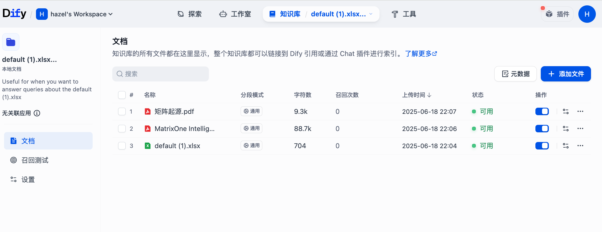

## Dify Platform Integration Guide for MatrixOne  

This document describes how to integrate the Dify platform with the MatrixOne database, using MatrixOne as the vector storage backend for Dify.

## Prerequisites  

### Install Git  

Install Git via the [official documentation](https://git-scm.com/download/mac).  
Verify the installation by running `git version`. A successful installation will display output similar to the following:  

```bash
> git version
git version 2.40.0
```

### Install Docker  

1. Click <a href="https://docs.docker.com/get-docker/" target="_blank">Get Docker</a> to visit the official Docker documentation page. Download and install Docker according to your operating system. It is recommended to use Docker version 20.10.18 or higher, and ensure the Docker client and server versions match.  
2. After installation, verify the Docker version to confirm successful installation:  

    ```bash
    docker --version
    ```  

    Example output for a successful installation:  

    ```bash
    Docker version 20.10.18, build 100c701
    ```  

3. Open your local Docker client and start Docker.  

## Steps

### Obtain Dify Code  

Clone the latest Dify source code to your local environment:  

```bash
git clone https://github.com/langgenius/dify.git
```  

### Build Docker Image  

```bash
cd dify/api
docker build -t langgenius/dify-api:mo .
```  

### Configure Environment  

```bash
cd ../docker
cp .env.example .env
```  

Edit the `.env` file to configure MatrixOne connection parameters:  

```bash
VECTOR_STORE=matrixone # Set vector store type to matrixone (required)
MATRIXONE_HOST=matrixone # IP/hostname of the MatrixOne instance (optional)
MATRIXONE_PORT=6001 # Port number (optional)
MATRIXONE_USER=dump # Username (optional)
MATRIXONE_PASSWORD=111 # Password (optional)
MATRIXONE_DATABASE=dify # Database name (optional)
```  

### Modify Docker Compose Configuration  

Edit the `docker-compose.yaml` file: Replace the `dify-api` image with `langgenius/dify-api:mo` (note: two locations require modification).  

### Start Dify Service  

```bash
docker compose up -d
```  

### Configure Dify Platform  

1. Visit <http://localhost/install> to complete the initial setup.  
2. Navigate to the settings page to configure the AI model:  
      - Select the model provider.  
      - Configure the API Key.  
      - Choose the appropriate model.  
3. Create a knowledge base:  
      - Upload the required files.  
      - Verify data import.  
  
  

### Verify Integration  

```bash
> mysql -u root -p111 -h 127.0.0.1 -P 6001
mysql: [Warning] Using a password on the command line interface can be insecure.
Welcome to the MySQL monitor. Commands end with ; or \g.
Your MySQL connection id is 287
Server version: 8.0.30-MatrixOne-v2.2.0 MatrixOne
Copyright (c) 2000, 2018, Oracle and/or its affiliates. All rights reserved.
Oracle is a registered trademark of Oracle Corporation and/or its
affiliates. Other names may be trademarks of their respective
owners.
Type 'help;' or '\h' for help. Type '\c' to clear the current input statement.
mysql> use dify;
Reading table information for completion of table and column names
You can turn off this feature to get a quicker startup with -A
Database changed
mysql> show tables;
+--------------------------------------------------------+
| Tables_in_dify                                         |
+--------------------------------------------------------+
| vector_index_6418005e_dfdb_4add_a5f8_c676fe6731b5_node |
+--------------------------------------------------------+
1 row in set (0.12 sec)
mysql> desc vector_index_6418005e_dfdb_4add_a5f8_c676fe6731b5_node;
+-------------+--------------+------+------+---------------------+-------+---------+
| Field       | Type         | Null | Key  | Default             | Extra | Comment |
+-------------+--------------+------+------+---------------------+-------+---------+
| id          | VARCHAR(36)  | NO   | PRI  | NULL                |       |         |
| embedding   | VECF64(1024) | NO   | MUL  | NULL                |       |         |
| document    | TEXT(0)      | YES  | MUL  | NULL                |       |         |
| meta        | JSON(0)      | YES  | MUL  | NULL                |       |         |
| create_time | DATETIME(0)  | YES  |      | CURRENT_TIMESTAMP() |       |         |
| update_time | DATETIME(0)  | YES  |      | CURRENT_TIMESTAMP() |       |         |
+-------------+--------------+------+------+---------------------+-------+---------+
6 rows in set (0.02 sec)
mysql> select count(*) from vector_index_6418005e_dfdb_4add_a5f8_c676fe6731b5_node;
+----------+
| count(*) |
+----------+
|      140 |
+----------+
1 row in set (0.00 sec)
mysql>
```  